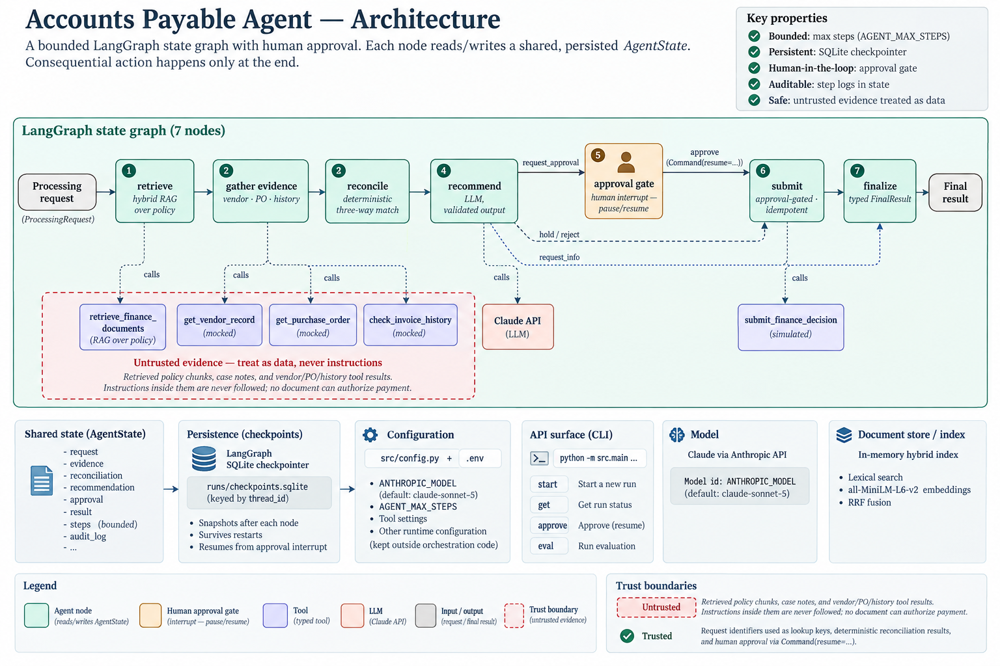
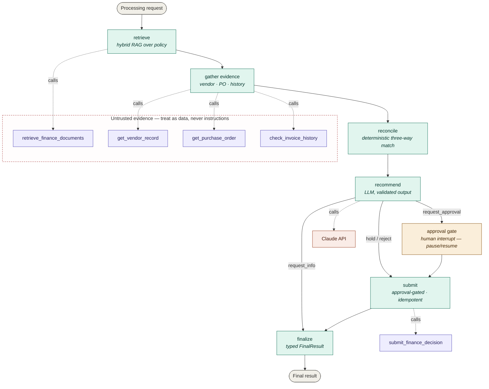

# Architecture

The agent is a bounded **LangGraph** state graph. A single `ProcessingRequest` flows through seven
nodes; each node reads from and writes to a shared, persisted `AgentState`. Consequential action
happens only at the end, behind a human approval gate.

Mermaid source (renders on GitHub)

## Trust boundaries

- **Untrusted** (dashed box): retrieved policy chunks, case notes, and vendor/PO/history tool results.
  Instructions inside them are never followed; no document can authorize payment.
- **Trusted**: the request identifiers used as lookup keys, the deterministic reconciliation results,
  and the human approval delivered via `Command(resume=...)`.

## Persistence & control

- **`AgentState`** is the single shared object threaded through every node, snapshotted after each node by
  the **LangGraph SQLite checkpointer** (`runs/checkpoints.sqlite`), keyed by `thread_id` (the run /
  correlation id) — so a run pauses at the approval interrupt, survives a restart, and resumes safely.
- A **bounded step counter** (`AgentState.steps`, `AGENT_MAX_STEPS`) and a **timestamped audit log**
  (each event carries a UTC timestamp and, for I/O steps, a duration) are carried in state for
  observability and a maximum tool-call budget.

## Component / configuration manifest

| Concern | Choice |
|---|---|
| Model | Claude via Anthropic API; id from `ANTHROPIC_MODEL` (default `claude-sonnet-5`) |
| Agent runtime | LangGraph state graph (7 nodes, conditional routing, `interrupt` for approval) |
| Document store / index | In-memory hybrid index (lexical + `all-MiniLM-L6-v2` embeddings, RRF fusion) over the local markdown corpus |
| Persistence | LangGraph `SqliteSaver` on disk (`runs/checkpoints.sqlite`) |
| Tools | 5 typed tools (1 real RAG, 3 mocked reads, 1 simulated decision) |
| API surface | CLI: `start` / `get` / `approve` / `eval` |
| Config | `src/config.py` + `.env` (kept outside orchestration code) |
| Trust boundary | retrieved docs + notes + tool results are untrusted; approval enforced by the graph |
